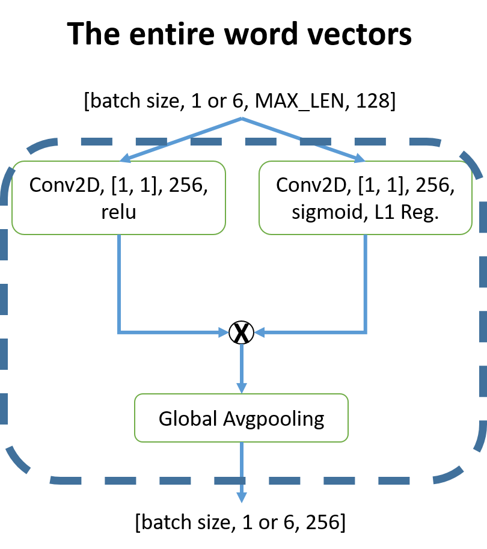
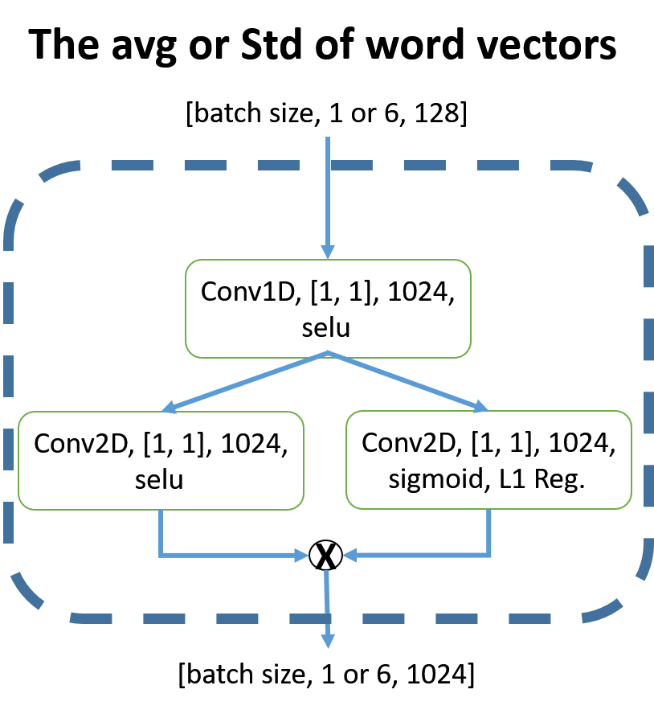
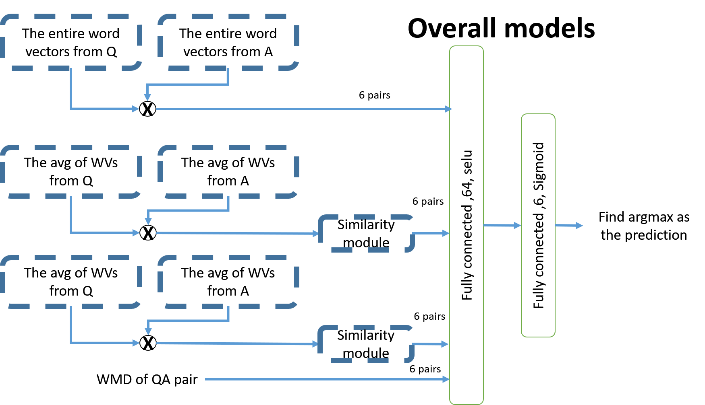

# Deep learning competition 1
**Team 2**
106061514, 許鈞棠 106061536, 廖學煒

## Cross-scoring method

Data preparation process is the same as the course slide<br>
Except: <br>
1.There is no truncation or common, rare words elimination while generating the dictionary <br\>(Out-of-Vocabulary is also considered)<br>
2.The error correction dictionary "my_dict.txt" is applied to 
fix those miscut vocabularies,<br>
ex: ["是","不","是"]-----> ["是不是"]


```python
%matplotlib inline
import pandas as pd
import jieba
import numpy as np
import jieba.posseg as pseg
def jieba_lines(lines):
    cut_lines = []
    for line in lines:
        cut_line = jieba.lcut(line)
        cut_lines.append(cut_line)
    return cut_lines
jieba.set_dictionary('big5_dict.txt')
jieba.load_userdict('my_dict.txt')
cut_programs = np.load('cut_Programs.npy')

```

    Building prefix dict from C:\Users\Administrator\Desktop\DL\Comp1\big5_dict.txt ...
    Loading model from cache C:\Users\ADMINI~1\AppData\Local\Temp\jieba.u4db63a6c4a8ce99b1489a4d22431124c.cache
    Loading model cost 0.819 seconds.
    Prefix dict has been built succesfully.
    

Training words vector using gensim's Word2Vec <br\>
Vector size: 150, 100 epochs, this will take about 40 minutes


```python
#this will run about 40 min

from gensim.test.utils import common_texts, get_tmpfile
from gensim.models import Word2Vec

model = Word2Vec(cut_programs,
                 size=150, #Dimensionality of the word vectors.
                 window=5,  #Maximum distance between the current and predicted word within a sentence.
                 min_count=0,# Ignores all words with total frequency lower than this.
                 workers=4)
 

model.train(cut_programs, total_examples=len(cut_programs), epochs=100)

model.save("word2vec.model")
print('done')
```

Generate voc_dict and cut_Questions using the same way as the course slide


```python
import pickle as pkl
voc_dict = np.load('voc_dict.npy')
cut_ques = np.load('cut_Questions.npy');print('Ques loaded')
model = word2vec.Word2Vec.load("word2vec.model");print('vec loaded')
hi_freq = np.load('voc_dict.npy');print('hi_freq loaded')
```

Create freq dictionary (key: chinese word, value: number of occurrence) <br/>
We save the word_dict (see course slide for more details) to word_dict.pkl beforehand<br/>


```python
import pickle
# hi_freq = np.load('word_dict.npy');print('hi_freq loaded')
with open('word_dict.pkl', 'rb') as f:
    hi_freq = pickle.load(f)
import matplotlib.pyplot as plt
plt.plot((HI_MAX-tmp[:500])/HI_MAX)
plt.show()
w1 =  "怎麼"
w2 = "幹嘛"
print(hi_freq[w1])
print(hi_freq[w2])
np.power(model.wv.similarity(w1,w2),4)

freq = {}
FROM = 0
TO = len(hi_freq)
for i in range(FROM,TO):
    freq[hi_freq[i][0]] =int(hi_freq[i][1])

HI_MAX = int(hi_freq[FROM][1])
print(HI_MAX)

```

This function could get the last sentence of the question


```python

def group(seq, sep):
    g = []
    for el in seq:
        if el == sep:
            yield g
            g = []
            continue
        g.append(el)
    yield g

ex = ['A', ' ', 'B' , 'C' , ' ' , 'D',' ']
result = list(group(ex, ' '))[-2]
print(result)
```

Special chinese word remapping <br/>
Ex: "拿到河邊去烤一烤"  -> "拿到河邊去烤"


```python
import jieba.posseg as pseg

def rep_fix(line):
    fix_line = []
    i=0
    while i<len(line):
        try:
            if line[i+1]=='一':
                if line[i] == line[i+2]:
                    fix_line.append(line[i])
                    i+=3
                    continue
        except:pass
        fix_line.append(line[i])
        i+=1

    return fix_line
```


```python
#these words will be eliminate if it appears in the question 
stop_words =  set([' ','這','你','我','的','不','是','是不是','啦','嗎','嘛','反而','又','有沒有','耶','啊','這麼','都','了'
                  ,'才','自己','應該','人','你還','其實','因為','該'])

time_words = set(['今天','明天','後天','現在','以前'])

#these words are not likely to appear in two consecutive lines
Non2_words = set(['可是','雖然','然而','如果'])

#對應句
#If the key word appear in the last sentence of the question, listening the value word 
#Option contains the value words is much likely to be the candidate
bonus = {'因為':['所以','就'],'就算':['還是','也是'],'雖然':['但是'],'為什麼':['因為']}
```

# The core of the scoring algorithm


```python
import collections
def get_score(cut_ques,debug = False):
    score = np.zeros([6,])
    lines = cut_ques[0]
    d = set()
    listen = set()
    
    #last sentence of the question
    last = list(group(lines[-2], ' '))[-1]
    
    #因為...所以...對應句listner
    for w in last:
        try:
            listen.add(bonus[w][0])
        except:continue

    for line in lines:
        for word in line:
            if word not in stop_words:
                d.add(word)
    
    #for each option
    for i in range(1, 7):
        line = cut_ques[i]
        line = rep_fix(line)

        for ai,a in enumerate(line):
            #If 對應句 matched, aggravating the score
            if a in listen: 
                score[i-1] += 0.5
            for q in d:
                s = 0
                try:
                    # power of four feature
                    s += np.power(model.wv.similarity(a,q),4)
                except:
                    #If the word is not found in the dictionary, it could be rare name
                    #If there's some option contain these name , add extra score to it
                    if a == q:
                        score[i-1]+= 0.4
                    continue
                s = min(s,0.7)
                #Increase the similarity of nested word
                #Ex:  
                #"中暑" contains the word "暑"
                for qq in q:
                    if qq in a:
                        s+=0.02
                        break
                #If question and the response is talking the same time, add an extra score
                #else we give it negative score penalty
                if (a in time_words) and (q in time_words):
                    if a != q:
                        s = -abs(s)*2               
                    else:
                        s = 1.0
                #If two word are matched yet their occurrence count is more than 200 in the program
                # 0.8 factor penalty is added
                #If Non2_words appear consecutively, add negative score
                elif a==q:
                    if hi_freq[a]>200:
                        s *=0.8

                    if (a in Non2_words) and (a in lines[-2]):
                        s = -abs(s)
                #As for those rare words, increase it's importance by *2
                else:
                    if hi_freq[a]<300 and hi_freq[q] <300 :
                        s *= 2.0
                hi_fil  = 8000  
                #These words are too common to be taken into account
                #However, they could be useful sometimes, so we multiply it by 0.31
                if hi_freq[a]>hi_fil and hi_freq[q] >hi_fil:
                    s *= 0.3
                #If one word is rare and the other is common, multiply it by 0.8
                elif (hi_freq[a]>hi_fil) != (hi_freq[q]>hi_fil):
                    s *= 0.8
                #debug code
                if s > 0.02 and debug:
                    print(i-1,q,a,np.round(s,4))
                
                score[i-1]+= s
            
        
    return score
get_score(cut_ques[316],debug = True)
```

Make prediction


```python
import  jieba.possegjieba.pos  as pseg
#for each question
ans = np.zeros([500,])
score = np.zeros([500,6])

for q_id,question in enumerate(cut_ques):
    score[q_id,:] = get_score(question)
    ans[q_id] = np.argmax(score[q_id,:])
    
ans = ans.astype(int)

```


```python
import csv
outname = 'output.csv'
with open(outname, 'w', newline='') as csvfile:
    writer = csv.writer(csvfile)
    writer.writerow(["Id","Answer"])
    for i,val in enumerate(ans):
        writer.writerow([ i, val])
print(outname)
```

## Train a QA-Robot by Neural Network
In this part, we trained a neural network model for the **QA-robot** in competition 1. This part will be organized in three parts: (a) Word embedding model, (b) generating training data and computing the features, and (c) the graph and the session of our neural network.

### Word vectors
To process the natural language sentence, we have to encode each chinese word before training the neural network model. We choose FastText as the word embedding model. All the sentences in training data were partitioned into word level by jieba, and converted into the format which can be read by gensim fasttext model. 


```python
# Processing training data as the same in the TA's example code and save in *.npy file format
# Read in the processed and partitioned word file and convert it into the format of gensim
import numpy as np
cut_programs = np.load('cut_Programs.npy')
cut_Question = np.load('cut_Questions.npy')
print(sum([len(p) for p in cut_programs]))

with open('split_word_Programs.txt', 'w', encoding='utf-8') as output:
    for i, program in enumerate(programs):
        episodes = len(program)
        print('Processing the %d programs' % i)
        for episode in range(episodes):
            for line in cut_programs[i][episode]:
                line_space = " ".join(line)
                output.write(line_space)
                output.write('\n')

with open('split_word_Questions.txt', 'w', encoding='utf-8') as output:
    n = len(questions)

    for i in range(n):
        for j in range(6):
            for line in cut_Question[i][j]:
                line_space = " ".join(line)
                output.write(line_space)
                output.write('\n')
                
# Train a fasttext model
from gensim.models import word2vec, doc2vec, FastText
import numpy as np

vec_size = 128
sentences = word2vec.LineSentence('split_word_Programs.txt')
model = FastText(sentences, size=vec_size, window=5,min_count=1)
model.save("fasttext"+str(vec_size)+".model")
```

### Generating training data
To train a QA-Robot model by the corpus from the normal programs, the data should be transformed into 1 question and 6 answer candidates format to. We define two consecutive sentences are a pair of correct question and answer. With exclusively and randomly selected 5 sentences, a complete QA pair is formed. Due to the tediousness of the lengthy codes, the codes are not shown in this report. Please refer to `gen_data.py` and `gen_data_infer.py` for the details of implementation.

### Computing the features
The most important problem of the feature extraction is how to deal with the variable length sentence. Therefore, we have tried 3 types of feature to unify the word vectors of different sentences:
1. Padding the word vectors to the length which is equals to the maximun legnth of the sentence in the training data. The data are padded with **wrapping values** instead of **zeros** for avoiding the numerical imbalance. The dimension of this feature is [*MAX_LEN*, *VECTOR_SIZE*].
2. Averaging all the word vectors (along the axis of words). The dimension of this feature is [*VECTOR_SIZE*].
3. Calculating the standard deviation from all the word vectors of the sentence. The dimension of this feature is also [*VECTOR_SIZE*].
4. Calculating the Word Mover's Distance (WMD) between the question and the answer candidate. The dimension of this feature is [*1*].
This codes are part of `gen_data.py` and `gen_data_infer.py`. Note that `self.w2vembedd2` is a FastText model and `self.w2vembedd` is a Doc2Vec model which was not used in the final version.

Several combinations of the features and corresponding were tested, more details and results will be discuessed in the next parts.


```python
def sentence2vec(self, sentence_idx):
    sentvec = sent = 0
    word_c2 = word_c = 0
    sent_sq = 0
    wv_seq = np.empty([0,VECTOR_SIZE])
    for i, w in enumerate(self.sentences[sentence_idx]):
        if MAX_LEN <= word_c:

            break
        if w.isalnum():
            try:
                wv_seq = np.vstack([wv_seq, self.w2vembedd2.wv[[w]]])
                word_c += 1
            except KeyError:
                pass
            try:
                sentvec += self.w2vembedd.wv[w]
                #sent_var += self.w2vembedd2.wv[w]**2
                word_c2 += 1
            except KeyError:
                pass
    if word_c > 0:
        sent = np.mean(wv_seq,0)
        sent_var = np.std(wv_seq,0)
    if word_c2 > 0:
        sentvec = sentvec / word_c2
    return np.concatenate([sentvec,sent,sent_var], 0), wv_seq
```

### The graph and the session of our neural network
We assume that different types of feature preserve its characteristic. The following figure is the overal scheme of our model:

|    |   |
|--------|--------|

  


```python
def question(q_sentence, training_flag):
    l1_regularizer = tf.contrib.layers.l1_regularizer(
        scale=1e-5, scope=None)
    frame_out = tf.layers.conv2d(q_sentence, 256, [1,1], kernel_initializer=tf.contrib.layers.xavier_initializer(), activation=tf.nn.relu)
    frame_att = tf.layers.conv2d(q_sentence, 256, [1,1], kernel_initializer=tf.contrib.layers.xavier_initializer(
        ), activation=tf.nn.sigmoid, kernel_regularizer=l1_regularizer)
    frame_out *= frame_att
    pool_size = frame_out.get_shape().as_list()[2]
    frame_out = tf.layers.average_pooling2d(
        frame_out, pool_size=[1,pool_size], strides=1)
    return frame_out


def answer(a_sentence, training_flag):
    l1_regularizer = tf.contrib.layers.l1_regularizer(
        scale=1e-5, scope=None)
    frame_out = tf.layers.conv2d(a_sentence, 256, [1,1], kernel_initializer=tf.contrib.layers.xavier_initializer(), activation=tf.nn.relu)
    frame_att = tf.layers.conv2d(a_sentence, 256, [1,1], kernel_initializer=tf.contrib.layers.xavier_initializer(
        ), activation=tf.nn.sigmoid, kernel_regularizer=l1_regularizer)
    frame_out *= frame_att
    pool_size = frame_out.get_shape().as_list()[2]
    frame_out = tf.layers.average_pooling2d(
        frame_out, pool_size=[1,pool_size], strides=1)
    return frame_out


def similar(logits_q, logits_a, training_flag, p,is_batchnorm=False,name='similarity'):

    qa_pair = tf.concat([logits_q * logits_a,logits_q**2,logits_a**2], -1)
    qa_pair = denselayer(qa_pair, 256, tf.nn.relu, is_batchnorm=is_batchnorm,
                         is_dropout=True, prob=p, is_training=training_flag, repeat=1)
    fc_out = denselayer(qa_pair, 64, tf.nn.relu, is_batchnorm=is_batchnorm,
                        is_dropout=False, prob=1, is_training=training_flag, repeat=1)
    return fc_out

def selection(simi_all, training_flag, p):
    qa_pair = simi_all
    qa_pair = denselayer(qa_pair, 64, tf.nn.selu, is_batchnorm=False,
                         is_dropout=False, prob=1, is_training=training_flag, repeat=1)
    fc_out = denselayer(qa_pair, 6, None, is_batchnorm=False,
                        is_dropout=False, prob=1, is_training=training_flag, repeat=1)
    return fc_out

dim = 1024
def dim_reduce(x_input, name, window=1,dim = 1024):
    with tf.variable_scope(name):
        l1_regularizer = tf.contrib.layers.l1_regularizer(
            scale=1e-5, scope=None)
        x = tf.layers.conv1d(x_input, dim, [
                             window], kernel_initializer=tf.contrib.layers.xavier_initializer(), activation=tf.nn.selu)
        
        xa = tf.layers.conv1d(x, dim, [
                             1], kernel_initializer=tf.contrib.layers.xavier_initializer(), activation=tf.nn.selu)
        x_att = tf.layers.conv1d(x, dim, [1], kernel_initializer=tf.contrib.layers.xavier_initializer(
        ), activation=tf.nn.sigmoid, kernel_regularizer=l1_regularizer)
        x = xa * x_att
        return x
```


```python
from gensim import models
    model = models.Word2Vec.load('doc2vec128.model')
    model2 = models.FastText.load('fasttext128.model')
    #model.init_sims(replace=True)
    model2.init_sims(replace=True)
    train_dataset = gen_dataset.dataset(w2v=model, w2v2=model2, val_ratio=0.2)
    test_dataset = gen_dataset_infer.dataset(
        w2v=model, w2v2=model2, val_ratio=0)
    tf.reset_default_graph()
    with tf.Graph().as_default() as g:
        x_input = tf.placeholder(
            tf.float32, [None, 7, gen_dataset.VECTOR_SIZE * 3])
        x_seq = tf.placeholder(
            tf.float32, [None, 7, gen_dataset.MAX_LEN, gen_dataset.VECTOR_SIZE])
        y_label = tf.placeholder(tf.float32, [None, 6])
        sim_tensor = tf.placeholder(tf.float32, [None, 6])
        training_flag = tf.placeholder(tf.bool)
        prob = tf.placeholder(tf.float32)
        
        #module for the all WVs
        simi_mat_red = tf.reshape(question(x_seq[:,0:1,:,:], training_flag) * answer(x_seq[:,1:,:,:], training_flag),[-1,256])
        
        #module for the avg. of WVs
        x1q = dim_reduce(
            x_input[:, 0:1, gen_dataset.VECTOR_SIZE:gen_dataset.VECTOR_SIZE * 2], 'red_1_q')
        x1a = dim_reduce(
            x_input[:, 1:, gen_dataset.VECTOR_SIZE:gen_dataset.VECTOR_SIZE * 2], 'red_1_a')
        
        #module for the std. of WVs
        x3q = dim_reduce(
            x_input[:, 0:1, gen_dataset.VECTOR_SIZE*2:gen_dataset.VECTOR_SIZE * 3], 'red_3_q')
        x3a = dim_reduce(
            x_input[:, 1:, gen_dataset.VECTOR_SIZE*2:gen_dataset.VECTOR_SIZE * 3], 'red_s3_a')

        x = tf.concat([x1q,x1a], 1)
        x3 = tf.concat([x3q,x3a], 1)

        x_question = tf.reshape(tf.tile(x[:, 0:1, :],[1,6,1]),[-1,x.shape[-1]])
        x_ans = tf.reshape(x[:, 1:, :],[-1,x.shape[-1]])
        x3_question = tf.reshape(tf.tile(x3[:, 0:1, :],[1,6,1]),[-1,x.shape[-1]])
        x3_ans = tf.reshape(x3[:, 1:, :],[-1,x.shape[-1]])

        a = similar(x_question, x_ans, training_flag, prob)
        b = similar(x3_question, x3_ans, training_flag, prob,is_batchnorm=True)

        sim_exp = tf.reshape(sim_tensor, [-1,1])
        simi_all = tf.concat([simi_mat_red,sim_exp], -1)
        simi_single = tf.reshape(simi_all, [-1, simi_all.shape[-1]])
        single_out = denselayer(simi_single, 64, tf.nn.selu, is_batchnorm=False,
                         is_dropout=False, prob=1, is_training=training_flag, repeat=1)
        single_out = denselayer(single_out, 1, None, is_batchnorm=False,
                         is_dropout=False, prob=1, is_training=training_flag, repeat=1)
        simi_all = tf.reshape(simi_all, [-1, simi_all.shape[-1] * 6])

        out = selection(simi_all, training_flag, prob)
        sigmoid_out = tf.nn.sigmoid(out)
        pred = tf.argmax(softmax_out,1)
        reg_ws = tf.get_collection(tf.GraphKeys.REGULARIZATION_LOSSES)
        loss_single = tf.reduce_mean(tf.nn.sigmoid_cross_entropy_with_logits(
            logits=single_out,  labels=tf.reshape(y_label,[-1,1])))
        loss = tf.reduce_mean(tf.nn.sigmoid_cross_entropy_with_logits(
            logits=out,  labels=y_label))
        loss = tf.reduce_sum(reg_ws) + loss_single + loss

        acc = tf.equal(tf.argmax(y_label, 1), pred)
        acc = tf.reduce_mean(tf.cast(acc, tf.float32))
        optimizer = tf.train.AdamOptimizer(learning_rate).minimize(loss)
        writer = tf.summary.FileWriter(graph_dir, tf.get_default_graph())
        init = tf.global_variables_initializer()
        saver = tf.train.Saver()
    config = tf.ConfigProto()
    config.gpu_options.allow_growth = True
    best_acc = 0
    early_count = 0
    ans = np.load('label.npy')
    with tf.Session(config=config, graph=g) as sess:
        writer = tf.summary.FileWriter(graph_dir, graph=sess.graph)
        sess.run(init)
        for i in range(3000):
            s, label, sim, wv_seq, end_flag = train_dataset.getbatch(
                mode='train', batch_size=batch_size)
            if end_flag != gen_dataset.IS_EPOCH_END:
                lo, _, a = sess.run([loss, optimizer, acc], feed_dict={
                                    x_input: s, y_label: label, sim_tensor: sim, x_seq:wv_seq, training_flag: True, prob: 0.8})
```

### Temporary results

We found that too small batch size leads the training instability (size < 128). Therefore, we tried 512, 1024, 2048 as the batch size. For selecting input feature, we first several model by only one type of feature. Surprisingly, the average and stadard deviation of the word vectors give a better results. We further try the different combination of the feature to train different model.

In the end of the competition, we selected 2 results for the deep learning methods. One is from the best parameters, another is from voting by different training results under different parameters.

| |  Best  | Voting  |
|----|--------|--------|
|Public score|0.612|0.648|
|Private score|0.688|0.692|

# Step 2: ensemble
We had implemented two models. Select the answer with the higher confidence score


```python
import pandas as pd 

data = pd.read_csv("ensemble.csv") 
data2 = pd.read_csv("output.csv") 
jo_pred = data.values[:,1]
my_pred = data2.values[:,1]

k=0
```


```python
import random as rnd


k_change = []
final = []

ma,de,av = [1.0,0.2,0.11] # max,difference of top 2 score, average

for i in range(500):
    ss = np.sort(score[i])
    delta = ss[-1] - ss[-2]
    ave = np.mean(ss)

    if ss[-1] <ma and delta <de or ave < av :
        final.append(jo_pred[i])
        if my_pred[i] !=jo_pred[i] and jo_pred[i] == label[i]:
            k_change.append(i)
    else:
        final.append(my_pred[i])
if (sum(label == final)/500) > 0.73:
    print(ma,de,av,len(k_change),sum(label == final)/500)
    print(k_change)


```
